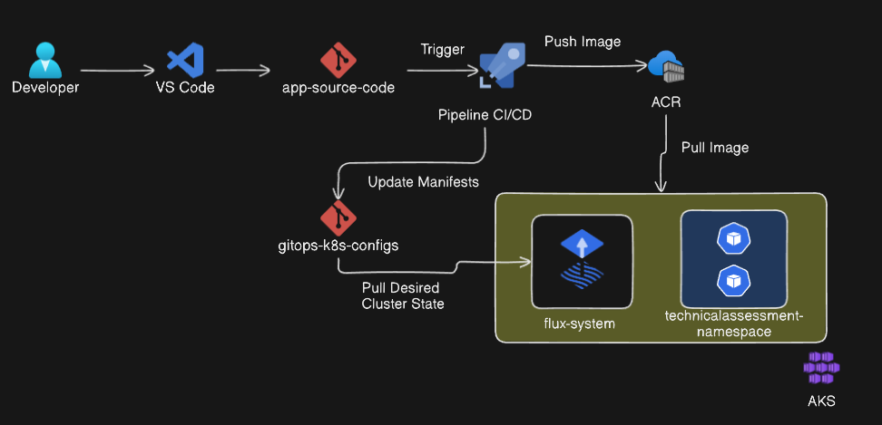
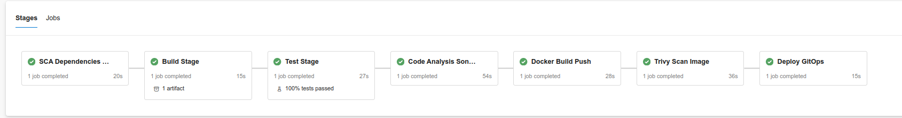
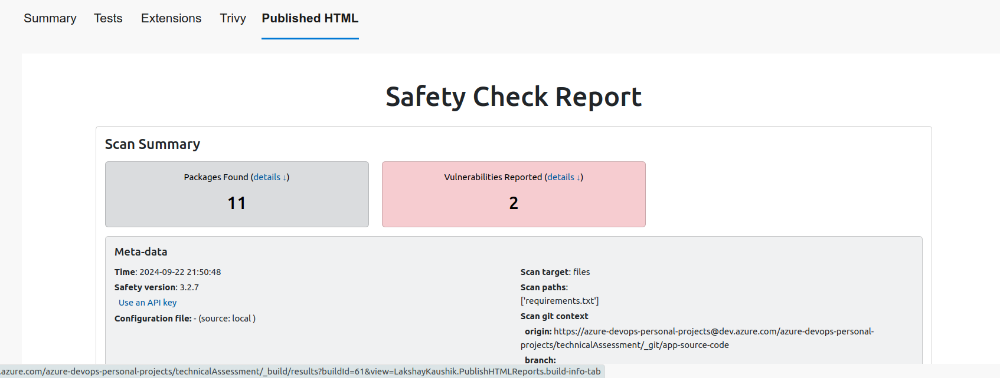
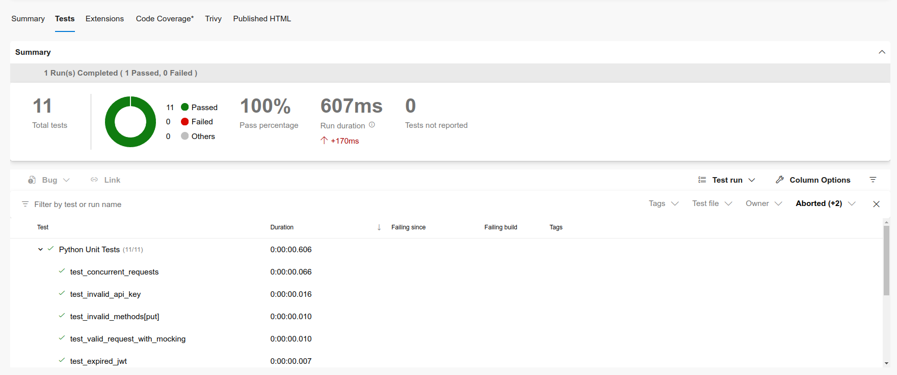
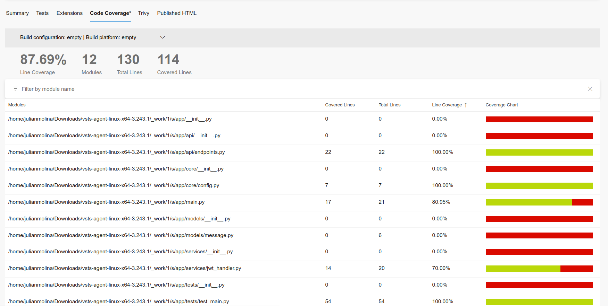
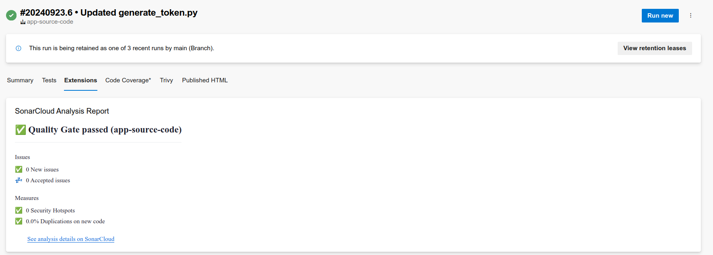
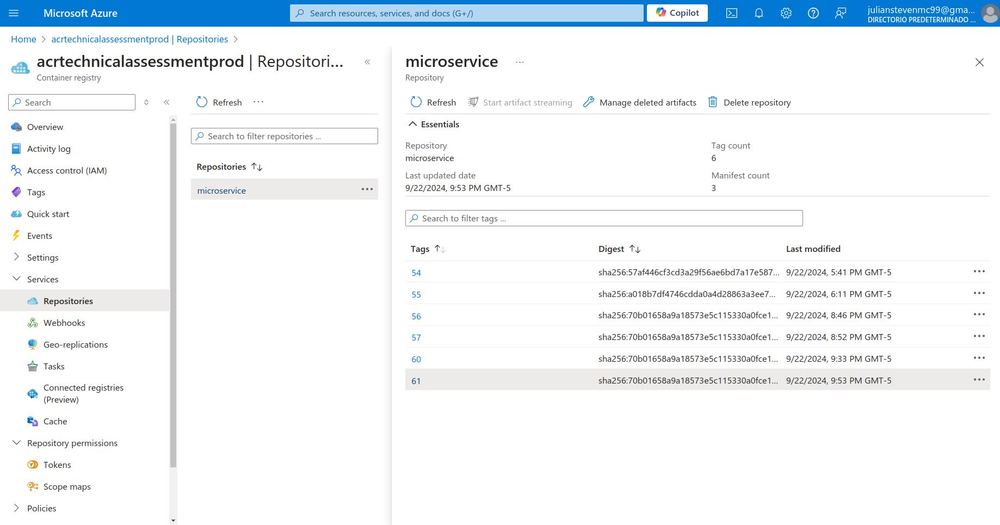
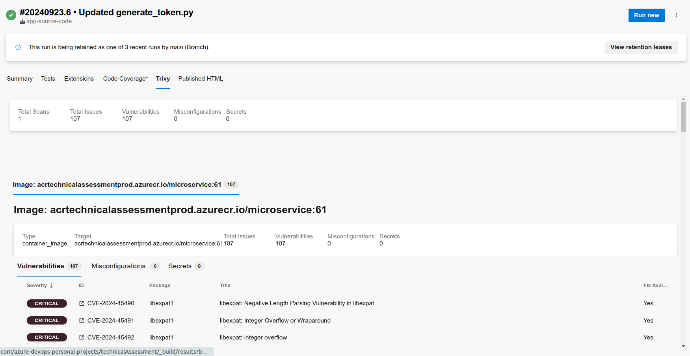
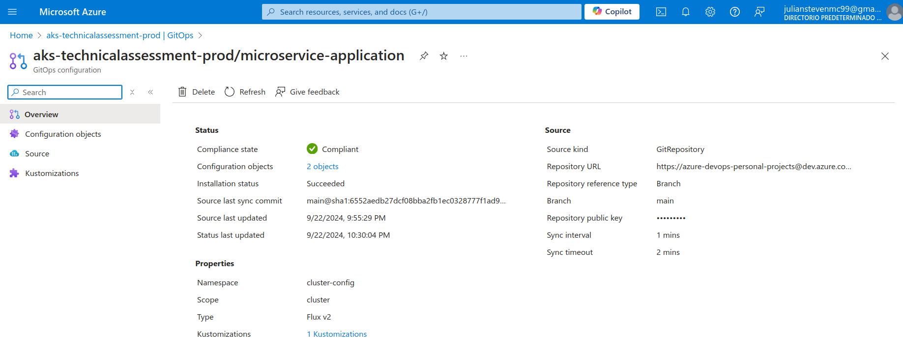

# Documentation of the pipeline implemented with GitOps

The following diagrams showcase the overall workflow and stages involved in the deployment pipeline for the microservice, utilizing GitOps, Azure Kubernetes Service (AKS), and Azure Container Registry (ACR).

**Workflow Overview**

In this diagram, the developer initiates the development process using VS Code, making changes in the App Repository. These changes trigger the CI/CD pipeline, which builds and pushes the Docker image to Azure Container Registry (ACR). Once the image is successfully pushed, the pipeline updates the deployment manifests in the GitOps Repository, which is then synced with the desired state in the Kubernetes cluster (AKS). The Flux component in AKS continuously pulls the latest manifests and ensures the cluster state matches the repository.

**Key points**:

- **ACR**: Stores the Docker images.
- **Flux**: Monitors the GitOps repo for changes and applies them to the AKS cluster.
- **GitOps**: Manages Kubernetes deployments by pulling the desired state from a repository.

## 1. SCA Dependency Analysis

- **Description:** This stage performs a vulnerability scan on the project dependencies using `Safety`. The `requirements.txt` file is used to install the dependencies and run the scan, generating an HTML report with the results.
- **Key point:** Helps to increase the security level by detecting bugs at an early stage.

## 2. Build Stage
- **Description:** In this stage, the secure `.env` file is downloaded from **Secure Files** in Azure DevOps, containing important variables such as `API_KEY` and `JWT_SECRET`. Project dependencies are installed and a `.zip` artifact is generated and published.
- **Key point:** The `.env` file ensures that sensitive variables are securely available to the application.

## 3. Testing stage

- **Description:** The secure `.env` file is downloaded, and unit tests are run using `pytest`, generating code coverage and test results, which are subsequently published.
- **Key point:** Validates functionality and code coverage.

## 4. Code analysis with SonarCloud

- **Description:** This stage performs a static analysis of the code using SonarCloud. The analysis helps to identify bugs and vulnerabilities before deployment, the analysis can be viewed at the following link: https://sonarcloud.io/summary/overall?id=app-source-code.
- **Key point:** SonarCloud ensures code quality, and the `.env` file is downloaded to maintain consistency at all stages.

## Docker Build and Push

- **Description:** The Docker image of the microservice is built, including the `.env` file with sensitive variables. The image is then pushed to Azure Container Registry (ACR), ready for deployment to AKS.
- **Key point:** The `.env` file ensures that the Docker image contains all the necessary configurations for the microservice.

## 6. Trivy Scan

- **Description:** The Docker image in ACR is scanned using `Trivy` to detect known security vulnerabilities.
- **Key point:** Helps to increase the level of security by detecting vulnerabilities in the Docker image.

## 7. GitOps Deployment

- **Description:** Deploying Azure extension for GitOps aks with FluxCD updates Kubernetes manifests with the new Docker image. A pull request is automatically created to merge the changes to the `main` branch, which deploys the microservice to AKS.
- **Key Point:** Automates the deployment of the microservice to AKS using GitOps, ensuring that the infrastructure is updated in a controlled manner.

# Application Overview

The FastAPI microservice exposes a `/DevOps` endpoint secured by an **API Key** and **JWT**, with the keys stored in the `.env` file. The JWT is verified using a secret stored in this file, ensuring security in all requests. The environment variables are managed through **Secure Files** in Azure Pipelines, ensuring they are protected and only available during pipeline execution.

